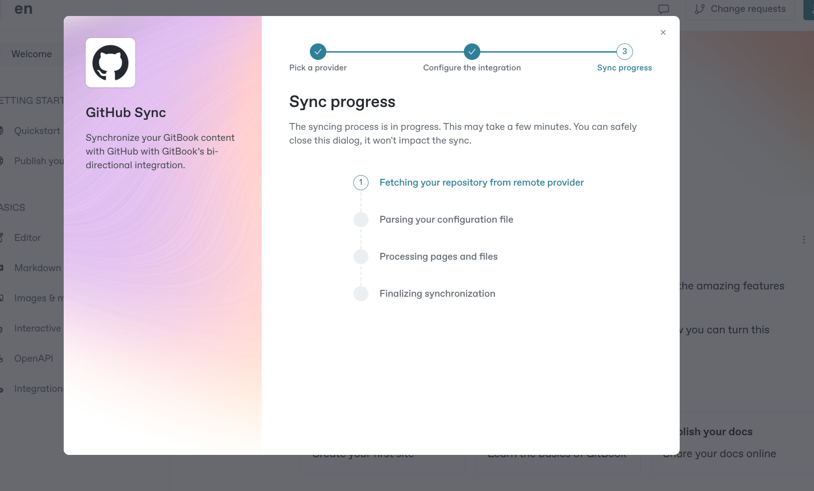

# Welcome

Добро пожаловать в стартовый шаблон GitBook! Здесь вы получите обзор всех замечательных функций GitBook, которые помогут вам создавать красивую интерактивную документацию.

Вы увидите лучшие возможности GitBook в действии и получите советы о том, как это можно реализовать.

### Jump right in be



<figure><figcaption></figcaption></figure>

<table data-view="cards"><thead><tr><th></th><th></th><th data-hidden data-card-cover data-type="files"></th><th data-hidden></th><th data-hidden data-card-target data-type="content-ref"></th></tr></thead><tbody><tr><td><strong>Начало работы</strong></td><td>Создайте свой первый сайт</td><td></td><td></td><td><a href="getting-started/quickstart.md">quickstart.md</a></td></tr><tr><td><strong>Основы</strong></td><td>Изучите основы GitBook</td><td></td><td></td><td><a href="broken-reference">Нерабочая ссылка</a></td></tr><tr><td><strong>Публикация документов</strong></td><td>Делитесь документами онлайн</td><td></td><td></td><td><a href="getting-started/publish-your-docs.md">publish-your-docs.md</a></td></tr></tbody></table>

<figure><figcaption></figcaption></figure>

<figure><figcaption></figcaption></figure>

<figure><figcaption></figcaption></figure>


